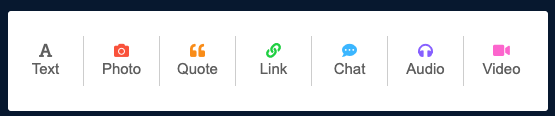
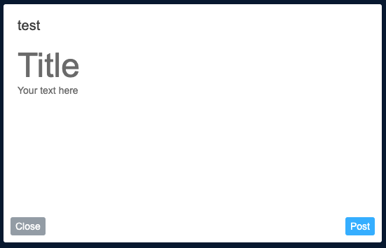
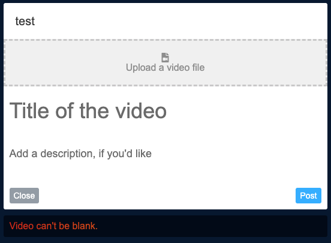
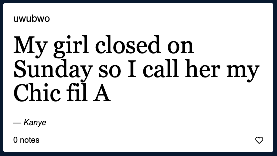
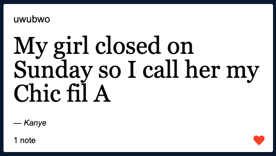

#  [Reposti](https://reposti.herokuapp.com)
A Tumblr Clone by Scott Ha

Reposti is a full-stack project that utilizes a Rails server running with PostgreSQL as the backend and React/Redux as the frontend. It takes advantage of the Amazon S3 hosting services.

## Features

**Creation of a Post of Varying Media Types**

On the main dashboard of the website, the user is presented with the option to create 1 of 7 post types at any moment.



By clicking on one of the available types of posts to create, you will be presented with the appropriate form.

_Text Form Example_



_Video Form Example with Validation Error(s)_



**Liking a Post**

Users can like a post that they enjoy.

_The Post before Like_



_The Post after Like_



Users can also then navigate to their [Likes](https://reposti.herokuapp.com/#/likes) page to view the posts they have previously liked.

**Following and Unfollowing Other Users**

Users can follow and unfollow other users on the website and see their posts on the dashboard. The feaure is presented when looking at another user's page.


```Javascript
  Give me VBucks